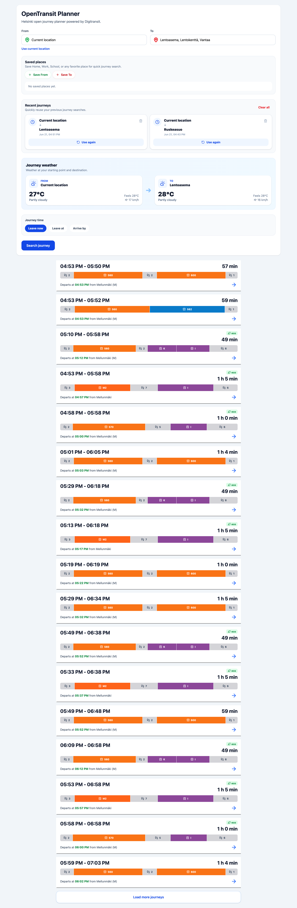
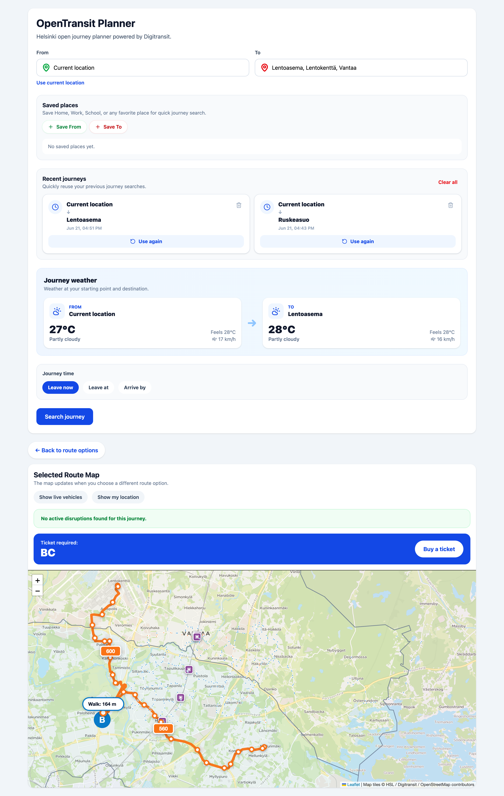
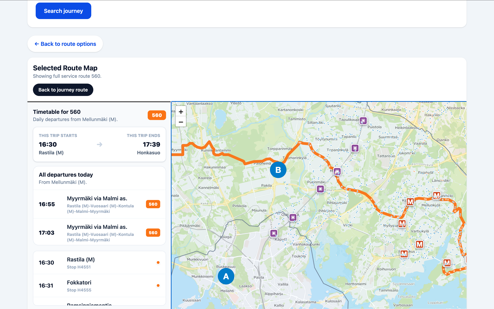

# OpenTransit Planner 🚍

OpenTransit Planner is a full-stack public transportation journey planner built for the Helsinki region using Digitransit APIs. The application helps users search routes between locations, view detailed journey information, explore stops on an interactive map, monitor service alerts, check weather conditions, save favorite locations, and plan trips based on departure or arrival times.

The project was developed as a portfolio-grade full-stack application demonstrating modern frontend and backend development practices using React and Laravel.

---

## 🌟 Features

### Journey Planning

* Search routes between any two locations
* Multiple route alternatives
* Detailed journey breakdown
* Walking, bus, tram, metro, train and ferry support
* Route duration and transfer information
* Load additional route options with pagination

### Departure & Arrival Time Planning

* Leave Now
* Leave At specific date and time
* Arrive By specific date and time
* Future journey planning

### Interactive Route Map

* Visual route display on OpenStreetMap
* Route geometry visualization
* Stop markers
* Journey path rendering
* Route details and stop sequence

### Location Search

* Location autocomplete
* Geocoding support
* Reverse geocoding
* Current location detection
* Saved locations

### Saved Places

* Save Home
* Save Work
* Save School
* Save favorite locations
* Quick route search using saved places

### Journey History

* Automatically save recent searches
* Reuse previous journeys
* Clear journey history

### Stop Information

* Nearby stops
* Stop departures
* Stop schedules
* Route-specific departures

### Real-Time Journey Information

* Live departure data
* Route tracking
* Trip details
* Service disruptions

### Service Alerts

* Digitransit/HSL service alerts
* Route-specific alerts
* Disruption notifications

### Weather Integration

* Weather at origin location
* Weather at destination location
* Temperature
* Wind speed
* Conditions overview

### Responsive Design

* Mobile-friendly
* Tablet-friendly
* Desktop-friendly
* Modern user interface

---


## 🌐 Live Demo

The application is deployed and publicly accessible:

### Frontend (Vercel)

[OpenTransit Planner Live Demo](https://open-transit-planner.vercel.app/)

### Backend API (Render)

[Backend API](https://opentransit-backend.onrender.com)

---

## 🚀 Try It Out

1. Search for a starting location and destination.
2. View public transport route options across the Helsinki region.
3. Explore route details and interactive maps.
4. Check weather conditions for selected locations.
5. Save favorite places and reuse previous journey searches.
6. Use your current location for instant journey planning.

> Note: The backend is hosted on Render's free tier and may take a few seconds to wake up after periods of inactivity.

# ☁️ Deployment

### Frontend
- Hosted on Vercel
- Automatic deployment from GitHub

### Backend
- Hosted on Render
- Dockerized Laravel application
- Automatic deployment from GitHub


## 🛠️ Tech Stack

### Frontend

* React
* Vite
* Axios
* React Leaflet
* Leaflet
* Tailwind CSS
* Lucide React

### Backend

* Laravel 13
* PHP 8.4+
* Laravel HTTP Client
* Laravel API Routes

### External APIs

* Digitransit Routing API
* Digitransit GraphQL API
* OpenStreetMap
* Nominatim Geocoding
* Open-Meteo Weather API

---

## 📂 Project Structure

```text
OpenTransit-Planner
│
├── Frontend
│   ├── src
│   ├── public
│   └── package.json
│
├── Backend
│   ├── app
│   ├── routes
│   ├── config
│   ├── database
│   └── composer.json
│
└── README.md
```

---

# ⚙️ Frontend Installation

## 1. Clone Repository

```bash
git clone https://github.com/Bayezidtanmay/OpenTransit-Planner.git
```

## 2. Navigate To Frontend

```bash
cd OpenTransit-Planner/Frontend
```

## 3. Install Dependencies

```bash
npm install
```

## 4. Run Development Server

```bash
npm run dev
```

Frontend will run on:

```text
http://localhost:5173
```

---

# ⚙️ Backend Installation

## 1. Navigate To Backend

```bash
cd OpenTransit-Planner/Backend
```

## 2. Install Dependencies

```bash
composer install
```

## 3. Create Environment File

```bash
cp .env.example .env
```

## 4. Generate Application Key

```bash
php artisan key:generate
```

## 5. Create SQLite Database

```bash
touch database/database.sqlite
```

## 6. Run Migrations

```bash
php artisan migrate
```

## 7. Start Laravel Server

```bash
php artisan serve
```

Backend will run on:

```text
http://127.0.0.1:8000
```

---

# 🔑 Environment Variables

Add the following variables to your Backend `.env` file.

```env
DIGITRANSIT_API_KEY=your_api_key_here

DIGITRANSIT_ROUTING_URL=https://api.digitransit.fi/routing/v2/hsl/gtfs/v1
```

---

# 🚀 API Endpoints

### Journey Planning

```http
POST /api/journeys/plan
```

### Nearby Stops

```http
GET /api/journeys/map-stops
```

### Stop Schedule

```http
GET /api/journeys/stop-schedule
```

### Stop Board

```http
GET /api/journeys/stop-board
```

### Trip Route

```http
GET /api/journeys/trip-route
```

### Alerts

```http
GET /api/journeys/alerts
```

### Geocoding

```http
GET /api/geocode/search
```

### Reverse Geocoding

```http
GET /api/geocode/reverse
```

### Weather

```http
GET /api/weather
```

---

# 📸 Screenshots

## Journey Search



## Selected Journey Route



## Interactive Map



---

# 🎯 Learning Outcomes

This project demonstrates:

* REST API development with Laravel
* React component architecture
* External API integration
* GraphQL consumption
* Interactive mapping with Leaflet
* State management with React Hooks
* Responsive UI development
* Geolocation services
* Journey planning algorithms
* Full-stack application architecture

---

# 🔮 Future Improvements

* User authentication
* Personalized profiles
* Route sharing
* Push notifications
* Offline support (PWA)
* Real-time vehicle tracking
* Multi-language support
* Route comparison analytics

---

# 👨‍💻 Author

**Bayezid Rahman Tonmoy**

Full Stack Web Developer | React • Laravel • JavaScript • PHP

GitHub:
https://github.com/Bayezidtanmay

---

# 📄 License

This project was developed for educational and portfolio purposes. Feel free to explore the codebase, learn from the implementation, and use it as inspiration for your own projects.